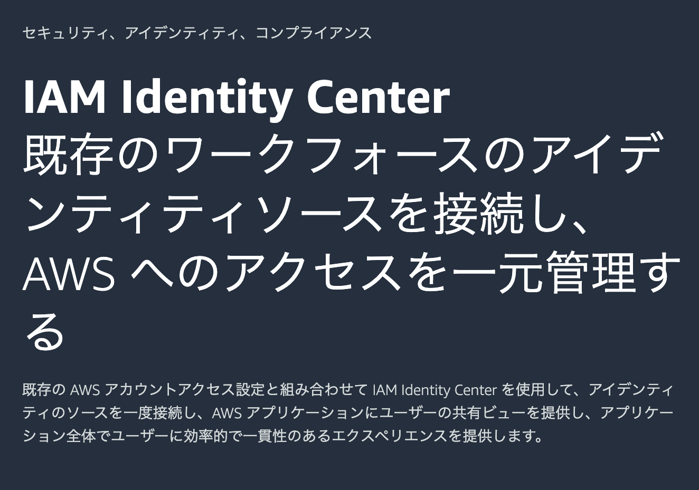
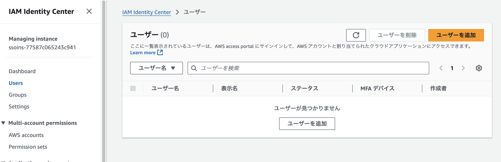
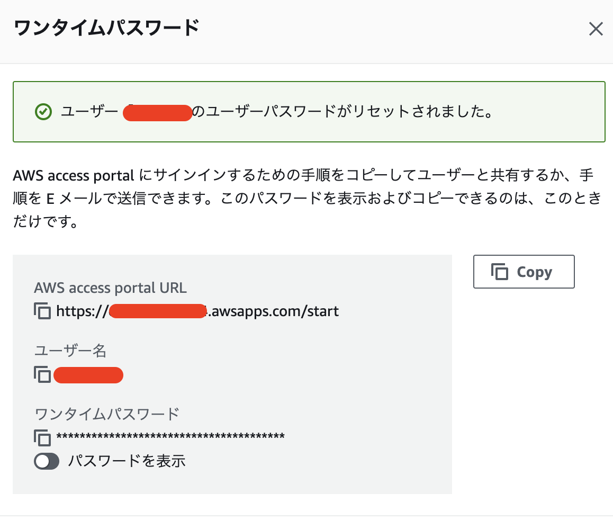

## IAM Identity Centerとは？

従来のAWS Single Sign-On (AWS SSO)がAWS IAM Identity Centerになったものです

## 使用方法

まずは、IAM Identity Centerを検索し、有効化しましょう。



有効化するとダッシュボードに遷移します。

次にユーザを作成していきます。左のサイドバーのUserをクリックするとユーザの画面に遷移します。



ユーザを手順に沿って作成すると、以下のような画面が出てくるのでメモしておきましょう。



次に、許可セットをユーザから作成して、先ほどのユーザに追加しておきましょう。以下では、amplify-policyを追加したユーザを使用しています。

## ログイン

AWS CLIを使ってログインしていきます。

```shellsession
$ aws configure sso
SSO session name (Recommended): session-x
SSO start URL [None]: https://*******.awsapps.com/start
SSO region [None]: ap-northeast-1
SSO registration scopes [sso:account:access]:
Attempting to automatically open the SSO authorization page in your default browser.
If the browser does not open or you wish to use a different device to authorize this request, open the following URL:

https://<url>

The only AWS account available to you is: ******
Using the account ID ******
The only role available to you is: amplify-policy
Using the role name "amplify-policy"
CLI default client Region [None]: ap-northeast-1
CLI default output format [None]: json
CLI profile name [amplify-policy-******]: default

To use this profile, specify the profile name using --profile, as shown:

aws s3 ls --profile default
```

ログインが完了したら、`~/.aws/config` が作成できていることを確認します。

```shellsession
$ cat ~/.aws/config
[profile admin]
sso_session = session-x
sso_account_id = ****
sso_role_name = amplify-policy
region = ap-northeast-1
output = json
[sso-session session-x]
sso_start_url = https://*****.awsapps.com/start
sso_region = ap-northeast-1
sso_registration_scopes = sso:account:access
```

## amplifyでログインする例

```shellsession
npx ampx sandbox --profile default
```

とすると先ほどのprofileを用いてログインできます。
