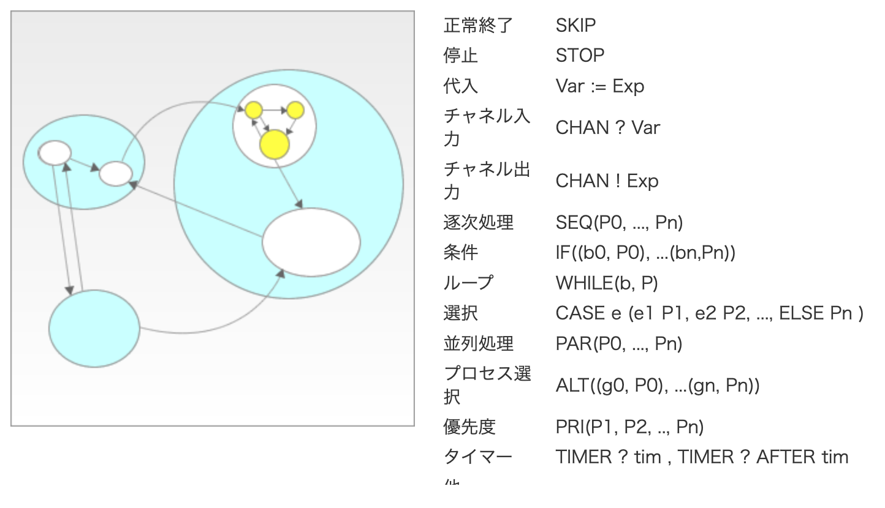

## 並行処理とは？

### 並行処理 v.s. 並列処理 v.s. 同期処理 v.s. 非同期処理

並行処理と似たような言葉に並列処理・同期処理・非同期処理との違いを解説いたします。

| 処理名 | 説明 | 例 |
|:-:|:-|:-|
| 並行処理  | 複数の処理を1つの主体が切り替えながらこなすこと  | 1人のシェフが野菜を切ったり、肉を焼いたりする |
| 並列処理  |複数の処理を複数の主体で同時にこなすこと   | 複数人のシェフが野菜を切ったり、肉を焼いたりする  |
| 同期処理  | 複数の処理をこなす際、ある処理が別の処理の終了を待つような処理  | 野菜を切りながら、肉を焼く  |
| 非同期処理  | 複数の処理をこなす際、ある処理は別の処理の終了を待たないような処理  | 野菜を切り終わってから、肉をやく  |

並列処理がコア1の場合並行処理となる。並列処理ができるかどうかはCPUのコア数に依存する。

### プロセス vs スレッド

プロセスとは、OSによって管理されていて同じメモリ領域を共有しないプログラム

プロセスが異なると、同じメモリ領域を一切共有しない。例えば、vscodeとwordは別プロセスで動いているが、互いに影響しない。

[プロセスとスレッドの違いとは？超わかりやすく解説！【図解とプログラム付き】 | Webpia](https://webpia.jp/thread_process/)

|  | 説明 |
|:-:|:-:|
| プロセス  |  具体的なプログラムがコンピュータのOSによって実行されているもの。 |
| ユーザスレッド  |ユーザースレッドは、1つのプロセスの中にある擬似的なスレッド。軽量スレッドとも呼ばれる。  |
| カーネルスレッド  |カーネルスレッドの実体はプロセス。軽量プロセスとも呼ばれる。他スレッド（つまり他プロセス）と変数の値などを共有している。  |

### マルチスレッド vs. マルチプロセス

マルチスレッドとは、１つのプログラムを複数に分割し、同時に処理を進める技術のこと

* マルチスレッドを使う場合は並行処理か並列処理かによらずスレッドセーフかどうかを考える必要がある

マルチプロセスでは、同じメモリ領域を共有しないため、競合状態の発生が少なくなる。しかし、プロセス間通信を行う必要があるため、スレッドよりもオーバーヘッド（処理負荷）が大きくなる。

マルチスレッドでは、複数のスレッドが同一のプロセス内で実行される。1つのプロセス内のすべてのスレッドは、同じメモリ空間を共有している。このため、競合状態になることがあり、同時に変数に書き込むなどの競合を生じることがありる。そのため、マルチスレッドでは、スレッド間でリソースの共有や同期の方法について明確に定義されなければならない。また、そのコードはスレッドセーフ(関数やクラス、変数などが、複数のスレッドから同時にアクセスされても、正しく動作すること)でなければならない。

マルチスレッドでは、スレッドの数が多いほどスケーラビリティが向上し、複数のタスクを同時に処理するための効果的な方法になる。一方で、マルチプロセスでは、プロセスの数を多くすることでスケーラビリティを向上させることができるが、プロセス生成のオーバーヘッドが大きくなるため、一定の制限がある。

### スレッドセーフとコンフリクト

1つのリソースに複数のアクセスがあるとコンフリクト(競合状態)となる。
スレッドセーフという言葉はプログラムの一部に存在する共通処理部分に対して使われる。 
リエントラント性という言葉は抽象的な話の中やタスクやスレッド自体が 複数の処理依頼を同時に受け付けることが出来るような場合に使用する。

[keyword9.pdf](https://www.embedded-ark.com/kpress/keyword9.pdf)

## Goの並行処理

Goの並行性のモデルは[CSP](https://ja.wikipedia.org/wiki/Communicating_Sequential_Processes)(Communicating Sequential Processes)に基づいている。CSPはTony Hoareの1978年の論文[Communicating
Sequential Processes](https://dl.acm.org/doi/pdf/10.1145/359576.359585)で述べられている。



goroutineはユーザスレッドとなっている。([プロセス-vs-スレッド](#プロセス-vs-スレッド))
並列処理にするには，runtimeパッケージの`GOMAXPROCS()`を使う，もしくは環境変数 `GOMAXPROCS` を設定する．
## 10.1　並行性をいつ利用するべきか

やってはいけないこと

1. なんでもかんでもゴルーチンに入れる
2. 全然早くならないからチャネルにバッファを追加する
3. チャネルがブロックして、デッドロックになったので、バッファ付きのチャネルを使用してバッファを限りなく大きくする
4. mutexを使おう
5. 諦める

## 10.2　ゴルーチン

goroutineは、Goの並行性モデルの中核となる概念。

* プロセス : 具体的なプログラムがコンピュータのOSによって実行されているもの。
* スレッド : 実行の単位。OSから決められた時間が与えられて実行される。1つのプロセスは1以上のスレッドから成る。

* ユーザスレッド : ユーザースレッドは、1つのプロセスの中にある擬似的なスレッド。軽量スレッドとも呼ばれる。  |
* カーネルスレッド : カーネルスレッドの実体はプロセス。軽量プロセスとも呼ばれる。他スレッド（つまり他プロセス）と変数の値などを共有している。  |

goroutineはユーザスレッドで、Goのランタイムによって管理される軽いスレッド。
Goのプログラムが開始されるとき、Goのランタイムが、プログラムを実行するためにいくつかのスレッドを生成し、一つのゴルーチンを起動する。

関数の前に"go"を付けて、実行するだけでgoroutineが生成

```go
go function()
```

無名関数も可能。

```go
go func() {
...  
}()
```

[playground](https://go.dev/play/p/UF-87s9VmYP)

```go
func Say(s string) {
 fmt.Println(s)
}

func main() {
 go Say("hello")
 go Say("world")
}
```

[playground](https://go.dev/play/p/2cPLvesFBWz)

```go
func Say(s string) {
 fmt.Println(s)
}

func main() {
 go Say("hello")
 go Say("world")
 fmt.Scanln()
}
```

## 10.3 チャネル

ゴルーチンは、情報のやり取りにチャネル(channel)を使う。チャネルもスライスやマップと同様に組み込みの型。参照型。
関数にチャネルを渡すとき、実際はチャネルへのポインタを渡す。チャネルのゼロ値はnil。

```go title="チャネルの生成"
ch := make(chan int)
```

### 10.3.1　読み込み、書き込み、バッファリング


`<-`を使う。

```go
a := <-ch // チャネル変数chから値を読みこみ、aに代入する
ch <- b // チャネルへの書き込み。bの値をチャネル変数chに書き込む
```

[goroutineの可視化](https://divan.dev/posts/go_concurrency_visualize/)

チャネルに書き込まれた値は一度だけ読み込むことができる。同じチャネルから複数のゴルーチンが読み込みを行っている場合、チャネルに書かれた値は、そのうちの一つのゴルーチンからのみ読み込まれる。
一つのゴルーチンが同じチャネルに対して読み書き両方を行うのは一般的ではない。

デフォルトでは、チャネルはバッファリングされない。オープンされてバッファリングされていないチャネルへの書き込みが行われる時、書き込みがわのゴルーチンは、同じチャネルから他のゴルーチンが読み込みを行うまで停止する。同様に、オープンされ、バッファリングされていないチャネルからの読み込みを行っているゴルーチンは同じチャネルへ他のゴルーチンが書き込みを行うまで停止することになる。ゆえに、バッファリングされていないチャネルへの書き込み(あるいはバッファリングされていないチャネルからの読み込み)は、複数のゴルーチンが平行に実行されていないと起こり得ない。

バッファ付きの(バッファリングされる) チャネルもある。バッファ付きのチャネルに対しては、ブロックされることなしに、特定の回数の書き込みが行われる。バッファがいっぱいになると、それ以降のチャネルへの書き込みは一旦停止され、書き込みがわのゴルーチンはチャネルから読み込みが行われるまでブロックすることになる。同じように、バッファが空のチャネルから読み込みを行おうとするとブロックされる。

バッファリングされるチャネルの生成

```go
ch := make(chan int, 10)
```

ほとんどの場合はバッファリングされないチャネルを使うべきである。

`ch <-chan int`とすると受信専用、`ch chan<- int`のようにすると送信専用のチャネルであることを示し、関数に渡すことができる。

```go title="送信専用のchannel"
// 送信専用の容量10のchannel作成
c := make(chan<- int, 10)

// キューに送信
c <- 10

// 送信専用なのでコンパイルエラーになる。
fmt.Println(<-c)
```

```go title="受信専用のchannel"
// 受信専用の容量10のchannel作成
c := make(<-chan int, 10)

// 受信専用なのでコンパイルエラー
c <- 10

fmt.Println(<-c) 
```

**標準のchannel型**　→ **入力 or 出力専用のchannel型**への代入は可能。

```go
func main() {
    c := make(chan int, 10)
    c2 := make(chan<- int, 10)

    c2 = c

    // c2に4を送信する
    c2 <- 4

    //　c2は送信専用なのでコンパイルエラー 
 //  fmt.Println(<-c2)   

    // cからを受信すると4を受け取れる
    fmt.Println(<-c)
}
```

### 10.3.2 for-rangeとチャネル

`for-range` を使うと、チャネルからの読み込みを行うことができる。

```go
for v := range ch {
    fmt.Println(v)
}
```

チャネルに関し宣言される変数は一つしかなく、それに値が代入される。この場合、チャネルがクローズされるまで、あるいはbreak文あるいはreturn文に出会うまでループする。

### 10.3.3 チャネルのクローズ

`close(ch)`でチャネルを閉じることができる。

クローズ後は書き込みや再度クローズしようとすると、パニックになる。読み込みは成功する。

クローズされたチャネルがバッファを持っており、まだ読まれていない値がある場合は、その値が順番に返される。
バッファリングされていないチャネルであるか、バッファに値が残っていない場合はチャネルの型のゼロ値が返される。

チャネルから読み込みを行う際は「書き込まれたゼロ値」と「チャネルがクローズされていたために戻されたゼロ値」とを区別しなければならない。
カンマokイディオムを使ってチャネルがクローズされたかどうかを検知する。

```go
v, ok := <-ch
```

okがtrueならば、チャネルはオープンしており、vにはチャネルchから読み込まれた値が入っている。
okがfalseならば、チャネルはクローズで、vにはゼロ値が入っている。

### 10.3.4　チャネルの動作

|          |    バッファ無 + 開     | バッファ無 + 閉 |         バッファ有 +開         |         バッファ有 +閉         |       nil        |
| :------: | :--------------------: | :-------------: | :----------------------------: | :----------------------------: | :--------------: |  
| 読み込み | 書き込まれるまでポーズ |  ゼロ値を返す   |     バッファが空ならポーズ     | バッファに残されている値を戻す | 無限にハングする |
| 書き込み | 読み込まれるまでポーズ |  **パニック**   | バッファがいっぱいならばポーズ |          **パニック**          | 無限にハングする |
| クローズ |      クローズする      |  **パニック**   |          クローズする          |          **パニック**          |   **パニック**   |

特にパニックになる以下2つには注意。

* 同じチャネルを二度クローズする
* 一つのゴルーチン内でチャネルをクローズした後で別のゴルーチンがそのチャネルへ書き込む

## 10.4 select

Goにおける並行性の制御構造そのもので、平行操作の優先順をエレガントに解決する。
どれかをいつも優先すると、場合によってはスターベーションが起こる。(スターべーションのもっとも発生しやすくもっとも深刻な状況が，デッドロック)

[1行でデッドロック](https://go.dev/play/p/5rgmh0r4ufh)

[デッドロックの例ex1003](https://go.dev/play/p/MCGCLBMB7SE)

`select`を使うことで、複数のチャネルに対する読み込み、あるいは書き込みの操作が可能になる。ブランクswitchと似ている。
switchは上から順番にチェックするのに対して、select文のcaseは実行順序には関係なく、データの準備ができているcaseから **ランダム** に選択する。

[https://go.dev/play/p/bjQrSrn4kPI](select文の例)

また、selectがランダムに選択することによって、デッドロックの原因の１つである、**整合性がない順番でロックを取得すること** を防ぐ。
デッドロックになると`fatal error: all goroutines are asleep - deadlock!`といったエラーが表示される。

[selectでデッドロックが解消する例ex1004](https://go.dev/play/p/qSTjx2l02fK)

selectは以下のように回文で使われることが多く、よく**for-selectループ**と言われる。

```go
for {
    select {
        case <- done:
            return
        case v := <-ch
            fmt.Println(v)
    }
}
```

select文でもdefaultを設定できる。defaultは前に進めるcaseがない場合に選択される。

```go
select {
    case v := <- ch:
        fmt.Println("chから読み込み:", v)
    default: 
        fmt.Println("chに書き込まれた値なし")
}
```

## 10.5 並行処理のベストプラクティスとパターン

### 10.5.1 APIに並行性は含めない

並行性は実装に関する詳細情報。実装の詳細はAPIとして表には出してはいけない。
表に出すAPIを変えることなく実装方法を変更できるため。

APIとして公開する型、関数、メソッドにチャネルを含めないようにする。
チャネルを表に出すとチャネル管理の責任をAPIのユーザに負わせることになってしまう。
チャネルがバッファリングされているか、クローズされたか、nilかどうかを利用者が気にしなければならなくなる。想定されていない順序でチャネルにアクセスすることで、デッドロックを招くことになる。

### 10.5.2　ゴルーチンとforループ

forループ内のゴルーチンが外側のループの値を使用すると、どのループ時点での値かが不定となる。

[ex1005.go](https://go.dev/play/p/2TLp3sKqjgX)

```go
a := []int{2, 4, 6, 8, 10, 12, 14, 16, 18, 20} //liststart
ch := make(chan int, len(a))
for _, v := range a {
    go func() {
        ch <- v * 2
    }()
}
for i := 0; i < len(a); i++ {
    fmt.Print(<-ch, " ")
} //listend
fmt.Println()
```

for文の最後まで到達して、ゴルーチンが全てt起動していれば、vは20になるが、そうでなければさまざまな値をvはとる。

ループ内でシャドーイングすることで、解決する。
[ex1005b.go](https://go.dev/play/p/ZS8bFaHJ5ki)

```diff
 a := []int{2, 4, 6, 8, 10, 12, 14, 16, 18, 20}
 ch := make(chan int, len(a))
 for _, v := range a { //liststart
+  v := v  // 外側のvをシャドーする
  go func() {
   ch <- v * 2
  }()
 } //listend
 for i := 0; i < len(a); i++ {
  fmt.Print(<-ch, " ")
 }
 fmt.Println()
```

for文以外にも、外側の変数にgorotineが依存している場合は、同じ問題が生じる。

他の解決策として、goroutineの引数に値を渡す方法もある。[ex1005c.go](https://go.dev/play/p/qAShOz0M9x4)

```go
a := []int{2, 4, 6, 8, 10, 12, 14, 16, 18, 20}
ch := make(chan int, len(a))
for _, v := range a { //liststart
    go func(val int) { // valの値は下の引数vの値になる
        ch <- val * 2
    }(v)  // vの値を無名関数に引数で渡す
} //listend
for i := 0; i < len(a); i++ {
    fmt.Print(<-ch, " ")
}
fmt.Println()
```

### 10.5.3 ゴルーチンの終了チェック

goroutineとして実行される関数を起動する場合は **確実に終了させる** 必要がある。
変数と違い、未使用のgoroutineは検知されない。goroutineが終了しない場合は、スケジューラは定期的にgoroutineに時間を割くので、全体の動作が遅くなる。(**ゴルーチンリーク** と呼ぶ)

速い：[ex1006.go](https://go.dev/play/p/gWO-LsruKrA)

breakしているので、遅い : [ex1006b.go](https://go.dev/play/p/Ctg2ggWVZMw)

### doneチャネルパターン

**doneチャネルパターン** を使用すると、goroutineに対して、処理を終了するべきであるというシグナルを送ることができる。
[ex1007.go](https://go.dev/play/p/ooS2opNKS5M)
[ex1007b.go(詳細版)](https://go.dev/play/p/Fbe2XTJfNwm)

```go
// 文字列sに関して、convertersに入っている関数を並行に実行して、もっとも早く終了した結果を返す
// 第1引数sは対象の文字列
// 第2引数convertersは「『文字列を受け取って、文字列を返す関数』を要素としてもつスライス」
// 戻り値は文字列
func convertData(s string, converters []func(string) message) message {
 done := make(chan struct{}) //空の構造体チャネル
 resultChan := make(chan message)
 for _, f := range converters {
  go func(f func(string) message) {
   r := f(s)
   select{
   case resultChan <- r:
    fmt.Printf("結果が戻ってきたのでresultChanに入れたあと: %v\n", r)
   case <- done:
     fmt.Println("case<-done選択", r.fromFunc)
   }
   fmt.Println("無名関数終了",r)
  }(f)
 }
 r := resultChan // 結果が返ってきたら
 close(done) // チャネルをクローズ
 return r
}
```

* select文の各caseで、resultチャネルへの書き込みか、doneチャネルへの書き込みを待つ
* オープンされたチャネルからの読み込みはデータの準備ができるまでポーズする
* クローズされたチャンネルの場合は常にそのチャネルのゼロ値が変える。
* 処理の最後に、resultに書き込まれた最初の値を読み込み、doneチャネルをcloseする(これがgoroutineの終了のシグナルとなり、ゴルーチンリークを防止する)

12.2 では、コンテキストを用いて、ゴルーチンが終了するべき時であることを伝える方法を説明します。

### 10.5.5 キャンセレーション関数を用いたゴルーチンの終了

[ex1008.go](https://go.dev/play/p/CmvvlR9lAxK)

チャネルだけでなく、処理をキャンセルするためのキャンセレーション関数も戻すことで、goroutineの実行をキャンセルしたくなったときにキャンセルできるようにできる。

キャンセルの目的
* 後続の処理を続けるため
  *例えば外部APIを実行する際にレスポンスが異常に遅い場合はネットワーク障害などの可能性もあるためタイムアウトする必要があります。
  * リソース解放のため
* goroutineをキャンセルせずに放置するとそのままリソースを消費し続ける可能性がある。

キャンセルの方法としては、`context.Context`を使用する、`WithDeadline関数`で指定時刻にキャンセルする、`WithTimeout関数`で指定時交互にキャンセルする方法などがある。

```go
func main() {
	ctx := context.Background()

	// 子のcontextを作成。第二返り値を使って子のコンテキストをキャンセルできる。
	ctxChild, cancel := context.WithCancel(ctx)

	// キャンセルされるまで無限ループするgoroutineを生成
	go func() {
		for {
			select {
			// キャンセルされると入る処理
			case <-ctxChild.Done():
				fmt.Println("context done")
				return
			// キャンセルされない間の処理
			default:
				fmt.Println("hello")
			}
		}
	}()

	// goroutineの処理が始まる前にキャンセルされるのを防ぐためスリープ
	time.Sleep(1 * time.Second)

	// キャンセル実行
	cancel()

	time.Sleep(1 * time.Second)
	fmt.Println("main end")
}
```

### 10.5.6 いつバッファ付きのチャネルを使うべきか

デフォルトではチャネルはバッファリングされない。(リレーのバトンのように単純な受け渡し)
バッファ付きのチャネルの動作は複雑になる。正しく使うには、バッファがいっぱいになった場合にどう対処するかを記述しなければならない。

バッファを使うのが有用なのは以下２つを満たすとき。

* goroutineがいくつ起動したか分かっている
* 起動するgoroutineの数を制限したい、もしくはバッファに入ったものの処理に制限をかけたい

例えば以下のような場合が挙げられる。

* 起動した一群のgoroutineからデータを集めるとき
* 並行実行の程度を制限したいとき
* システムがキューに入れた処理の量を管理して、関連する処理あるいは、プログラム全体の処理が遅くなってしまうのを防止したいとき

[ex1009.go](https://go.dev/play/p/fX-PIv0vlya)

### 10.5.7 バックプレッシャ

バッファ付きチャネルを使用するテクニックの一つに**バックプレッシャ**がある。

特定のコンポーネントの仕事の量を制限して、システムが全体として効率よく動作するように、バッファ付きチャネルとselect文を使って同時リクエストの数を制限する。

[ex10010.go](https://github.com/mushahiroyuki/lgo/blob/main/example/ch10/ex1010.go)

### 10.5.8　selectにおけるcaseの無効化

* case文のチャネルがクローズされた際、チャネル読み込みは成功するが、常にゼロ値が返る。
  * これは無駄な処理であるため、以降はスキップするよう対応が必要。
* チャネルがクローズされたら、チャネルにnilを設定することで、以降該当のcaseをスキップできる

[ex10010.5.go](https://go.dev/play/p/PaB83kKOh2W)

チャネルをnilにすることでselectの一つのcaseを無効化することができる。
caseにおいてはnilチャネルからの読み込みを返さないため、該当のcaseは実行されない。

### 10.5.9 タイムアウト

ほとんどの対話的なプログラムは所定の時間内にレスポンスを返す必要がある。Goの並行処理ではリクエストの実行時間を管理できる。他の言語では、プロミスやフィーチャーといった概念を導入していますが、Goでは、タイムアウトのイディオムを使うことで、比較的簡単に実現できる。

[ex10011.go](https://go.dev/play/p/jzTnZ6mBSpV)

### 10.5.10 WaitGroupの利用

1つのgoroutineが複数のgoroutineの処理の終了を待たなければならない。

* sync.WaitGroupを使うすべての場所で同じインスタンスが使われるようにするため。sync.WaitGroupに渡したにも関わらず、ポインタを使わないとその関数はコピーを持ち、Doneへの呼び出しがオリジナルのsync.WaitGroupをデクリメントしない。
* デザイン。並行性はAPIには含めないようにするため。

1つのgoroutineを待つ場合は[doneチャネルのパターン]()を使う。
複数ある場合は、標準ライブラリのパッケージsyncにある[WaitGroup](https://pkg.go.dev/sync#WaitGroup)を使う必要がある。

[ex10012.go](https://go.dev/play/p/_lINa2jP0wx)

sync.WaitGroupは明示的な初期化の必要はない。宣言するだけで、ゼロ値を使う。
以下3つのメソッドがある。

* Add : 終了を待つgoroutine数のカウンタを指定した数だけ増やす
* Done : カウンタをデクリメントする。処理が終了した時に呼ばれる
* Wait : カウンタが0になるまで、それを含むgoroutineを停止する

```go title="WaitGroup使い方"
var wg sync.WaitGroup

wg.Add(1)
go func() {
 /*何らかの処理*/
 wg.Done()
}()
wg.Add(1)
go func() {
 /*何らかの処理*/
 wg.Done()
}()

wg.Wait()
fmt.Println("タスクがすべて完了")
```

[playground](https://go.dev/play/p/SCP9XUuuWNj)

```go title="waitgroup使用しない例"
func main() {
 fmt.Println("開始")

 go func() {
  /*5秒待機*/
  time.Sleep(5 * time.Second)
  fmt.Println("end timer1")
 }()

 go func() {
  /*5秒待機*/
  time.Sleep(5 * time.Second)
  fmt.Println("end timer2")
 }()

 fmt.Println("終了")
}
```

[playground](https://go.dev/play/p/43envR6-UHA)

```go
func main() {
 fmt.Println("開始")
 var wg sync.WaitGroup

 wg.Add(1)
 go func() {
  /*5秒待機*/
  time.Sleep(5 * time.Second)
  fmt.Println("end timer1")
  wg.Done()
 }()

 wg.Add(1)
 go func() {
  /*5秒待機*/
  time.Sleep(5 * time.Second)
  fmt.Println("end timer2")
  wg.Done()
 }()

 wg.Wait()
 fmt.Println("終了")
}
```

以下は複数の値を複数のgoroutineで同時に処理して、結果をスライスに集め、そのスライスを返す関数。

 [ex10013.go](https://go.dev/play/p/nG1xITilTAu)

 sync.WaitGroupは便利だが、goroutineの協調のための第一の選択肢とするべきではない。処理を行うワーカーとなるgoroutineがすべて終了した後で、クリーンアップするものがあるときのみ用いる。

<Note title="errgroup">
 [errgroup](https://pkg.go.dev/golang.org/x/sync/errgroup)はsync.WaitGroupで作られている。これは一群のgoroutineを生成し、そのうち一つのgoroutineがエラーを返すと処理を停止する。
</Note>

### 10.5.11 コードを一度だけ実行

initを用いると、イミュータブルなパッケージレベルの状態を初期化することができる。
こうした初期化の処理のほかに、(起動直後にではなく後で)遅延読み込み(lazy load)したいときがある。初期化は比較的時間がかかる場合が多くいつも実行するわけではない時もある。こういう場合には`sync.once`を使用すると、必要な時に一度だけ特定の処理を実行できる。

 [ex10014.go](https://go.dev/play/p/GO5gy-yx0zn)

[playground](https://go.dev/play/p/0OgjRnXpZAi)

```go title="sync.onceの使用例"
func main() {
 var once sync.Once
 f := func() {
  fmt.Println("Done")
 }
 once.Do(f)
 once.Do(f)
 once.Do(f)
}
```

並行処理での`sync.once`のシンプルな例

[playground](https://go.dev/play/p/b6QDJnP0kpE)

```go title="並行処理の例"
func main() {
 var once sync.Once
 f := func() {
  fmt.Println("Done")
 }
 done := make(chan bool)
 for i := 0; i < 10; i++ {
  go func() {
   once.Do(f)
   done <- true
  }()
 }
 for i := 0; i < 10; i++ {
  <-done
 }
}
```

### 10.5.12 並行処理ツールの協調

3つのWeb Serviceを呼び出す関数がある。3つのうち2つのサービスにデータを送りそれぞれから結果を受け取る。受け取った２つの結果を3つ目のサービスに送り、結果をもらう。すべてのサービスは50ms以内で行われる必要があり、その条件が満たされない場合はエラーが返る。

 [ex10014.go](https://github.com/mushahiroyuki/lgo/blob/main/example/ch10/ex1015.go)

ゴルーチン、チャネル、selectを使ってコードを構成すると個別のステップを分離し、独立したパートが任意の順番で実行できることになり、各パートの間でのデータの交換がクリーンになる。また、プログラムのどのパートもハングさせずに関数内および呼び出しの履歴にある以前の関数でセットされたタイムアウトを正しく処理することができる。

## 10.6 チャネルの代わりにmutexを使うべきとき

他のプログラミング言語でスレッド間でデータへのアクセスをうまく行おうとすると **mutex** を使う。mutexによって共有されたデータに対するコードの並行実行やアクセスを制限する。保護された部分のことを **クリティカルセクション** と呼ぶ。mutexのデメリットはプログラムのデータの流れを不明瞭にする。それに対して、チャネルを介してgoroutineからgoroutineに値が渡されるときはデータの流れは明快である。その時点のデータへのアクセスは1つのgoroutineに限定されている。mutexがデータ保護に使われる際には、データの所有権を持っているのが、どのgoroutineなのかを示すものが何もない。データに対するアクセスは並行に実行されているプロセスの全てによって共有されている。このため、処理の順番を理解するのが、難しくなる。この考え方をGoのコミュニティでは、メモリの共有でコミュニケーションするのではなく、コミュニケーションによってメモリを共有すると表現している。

mutexを使った方がいいケースは、複数のgoroutineが共有されたデータを読み込んだり、単純な書き込みをしたりするものの、その値は処理しないというケースがある。

* goroutineの関係を調整しようとしている、あるいは一連のgoroutineによって変換されるデータを突ラックしているのならば、チャネルを使うべきである。
* 構造体のフィールドに対するアクセスを共有しているのならば、mutexを使うべきである。
* チャネルを使う際に致命的なパフォーマンスの問題があり、この問題を修正する方法が見つからないのならば、mutexを使うようにコードを変更するべきである。

mutexの問題として、以下2つが挙げられる。

* mutexを使うと余分なブックキーピングが必要になる。ロックを正しく取得・解除しないと、デッドロックになる。
* Goのmutexはリエントラントではない。1つのgoroutineが同じロックを2度取得しよ右とすると、デッドロックする。Javaはロックがリエントラントである。

(リエントラント（再入可能）: 複数のプログラムを並行して実行するマルチタスクにおいて、実行中プログラムが同時に他のプログラムから呼び出されても正常に処理できるという性質のこと)

リエントラントではない、ロックは、自分自身を再起的に呼び出す関数のロックの取得をトリッキーにする。再起的な関数呼び出しの前にロックを解除しなければならない。関数呼び出しをする際にロックを保持するのは注意が必要。呼び出し中にどのようなロックが取得されるか分からない。ある関数で同じmutexのロックを取得しようとするもう一つ別の関数を呼び出してしまうと、そのgoroutineはデッドロックする。

`sync.WaitGroup`や`sync.Once`同様、`mutexはコピーしてはダメ。関数に渡されたり、構造体のフィールドとして、アクセスされたりする際には、ポインタを介さなければならない。mutexがコピーされると、ロックは共有されない。

<Note title="sync.Map">
> sync.Mapとい並行実行を行なっても安全なうmapがある。以下のような特殊な場合に用いる。

* 共有マップでkey/valueのペアが一度だけ追加され、何度も読まれる
* 複数のgoroutineがmapを共有する際に、互いに他方が担当するキーと値にはアクセスしない。

[排他的ロックをしていない例](https://go.dev/play/p/CMr8owjlE4d)

[排他的ロックをしている例](https://go.dev/play/p/fRnukRq0CTV)
</Note>

## 10.7 sync/atomic

mutex以外にも複数スレッドが関係する場面で、データの一貫性を保つ方法が用意されている。`sync/atomic`には、モダンなCPUに組み込まれたアトミックな変数に対する操作のための機能が組み込まれている。一つのレジスタに十分入る値に他する加算、スワップ、ロード、ストア、比較とスワップ(CAS)のための機能。

パフォーマンスを最高レベルにまで高められる並行実行のエキスパートを自認するなら、Goの`sync/atomic`を使って並行性に纏わる処理を管理すれば十分である。


[playground](https://go.dev/play/p/n9iwkod4FFh)

```go
package multicpu_invalid

import (
    "sync"
    "sync/atomic"
)

func count() int64 {

    var count int64
    var wg sync.WaitGroup
    for i := 0; i < 1000; i++ {
        wg.Add(1)
        go func() {
            atomic.AddInt64(&count,1)
            wg.Done()
        }()
    }
    wg.Wait()
    return atomic.LoadInt64(&count)
}
```

## 10.8 まとめ

他にも多くの並行性に関するパターンがある。
[Go言語による並行処理](https://www.oreilly.co.jp/books/9784873118468/)がおすすめ。

# 参考文献

1. [Synchronous vs Asynchronous vs Concurrent vs Parallel | by Martin Thoma | Plain and Simple | Medium](https://medium.com/plain-and-simple/synchronous-vs-asynchronous-vs-concurrent-vs-parallel-4342bfb8b9f2)
1. [「マルチスレッドとマルチプロセス」と「並行処理と並列処理」は別々で考えないといけないよ](https://zenn.dev/chro96/articles/abcda94d41697b)
1. [python マルチスレッド マルチプロセス #Python - Qiita](https://qiita.com/Jungle-King/items/1d332a91647a3d996b82)