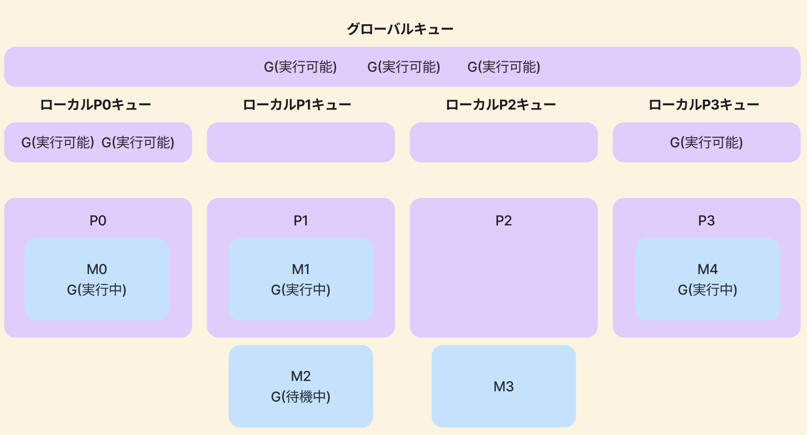

## スレッド

スレッドはOSが実行できる最小の処理単位。
あるプロセスが複数の処理を同時に実行したいときに複数のスレッドを作成する。

スレッドは並行(concurrent)と並列(parallel)の2つの状態がある。

OSは、スレッドのプロセスを最適にスケジュールする際に以下のことを満たす責任がある。

* すべてのスレッドは、あまり時間をあけずにCPUサイクルを消費できる
* 作業負荷は、複数のCPUコアにできるだけ均等に分散される

<Warn>
スレッドはCPUレベルでも別の意味を持つことがある。各物理コアは複数の論理コアで構成でき、この論理コアのことをスレッドという。ハイパースレッディング(hyperthreading)の概念。この記事のスレッドは論理コアでなく、処理の単位を意味する。
</Warn>

## コンテキストスイッチ

CPUコアはさまざまなスレッド(OSスレッド)を実行する。あるスレッドから別スレッドに切り替わる操作をコンテキストスイッチと呼ぶ。

## ゴルーチンとOSスレッド

Goでは、スレッドを直接生成することはできないが、アプリケーションレベルのスレッドであるゴルーチンは作成できる。

OSスレッドがOSによってCPUコアに対してコンテキストスイッチを切り替えるのに対して、ゴルーチンはGoのランタイムによってOSスレッドに対してコンテキストスイッチを切り替える。

OSスレッドに対し、ゴルーチンのスタックメモリサイズは小さく、Go1.4以降は2KBとなる。
OSスレッドのスタックメモリはOSに依存する。(Linux/x86-32の場合、デフォルトで2MB)アーキテクチャに依存するが、ゴルーチンのコンテキストスイッチはスレッドのコンテキストスイッチよりも約80~90%高速。

## Goのスケジューラ

* G(goroutine) : ゴルーチン
* M(machine) : OSスレッド
* P(processor) : CPUコア

OSスレッド(M)はOSスケジューラによってCPUコア(P)に割り当てられ、各々のゴルーチン(G)がM上で実行される。
GOMAXPROCS変数はユーザレベルのコードを同時実行するOSスレッド(M)の個数の上限。

スレッドがシステムコール(I/Oなど)によって待ちになると、スケジューラはさらにOSスレッド(M)を生成できる。GOMAXPROCSはデフォルトで利用可能なPの数と等しい。

### ゴルーチンのライフサイクル

* 実行中(executing) : ゴルーチンはOSスレッド(M)にスケジューリングされ、処理を実行する
* 実行可能(runnable) : ゴルーチンが実行中状態になるのを待つ
* 待機中(waiting) : ゴルーチンが停止し、システムコールや同期操作(mutexの取得など)の完了を待つ

### キューイング

ゴルーチンが作成されているがまだ実行できない時にGoランタイムはキューイングを行う。
Goランタイムは以下2つのキューを扱う。

* ローカルキュー : CPUコア(P)ごとに1つのキュー
* グローバルキュー : すべてのCPUコア(P)で共有されるキュー

GOMAXPROCS=4の4コアマシンでの、スケジューリングを考える。

論理コア(P)、ゴルーチン(G)、OSスレッド(M)、ローカルキュー、グローバルキューに分かれている。



最初に、GOMAXPROCS=4であるのに対して、OSスレッド(M)が5つあります。Goのランタイムでは、GOMAXPROCSよりも多くのOSスレッドを生成することが可能。

P0、P1、P3はGoランタイムスレッドの実行を行っている。
P2はM3がP2からコンテキストスイッチオフのためアイドル状態になって、実行されているゴルーチンが存在しない。

6つの実行可能なゴルーチンの実行が保留されて、グローバルキューで保存されているものとローカルキューで
保留されているものがあるので、この状態は好ましくない。

https://github.com/golang/go/blob/go1.17.6/src/runtime/proc.go#L3291

```go
runtime.schedule() {
  // 61回目の実行ごとに、Gのグローバル実行可能キューを調べる
  // 何もなければ、ローカルキューを調べる
  // 何もなければ、
  //     他のPから盗む
  //     盗むものがなければグローバル実行可能キューを調べる
  //     何もなければネットワークをポーリングします
}
```

61回目の実行ごとにGoスケジューラはグローバルキューにゴルーチンが保留されているか否かを調べる。もしなければローカルキューを調べる。一方、グローバルキューとローカルキューの両方が空ならば、Goスケジューラは他のローカルキューからゴルーチンを取り上げることができる。

このスケジューラの原理を**ワークスチール**(work stealing)と呼ぶ。
利用率の低いプロセッサが積極的に他のプロセッサのゴルーチンを探し、一部を盗み出す。

### preemptive v.s. cooperative

Go1.14より前のバージョンでは、スケジューラは協調的(cooperative)であり、ゴルーチンがスレッドからコンテキストスイッチオフされるのは特定の街の状態のみ。(チャネルの送受信、入出力、mutexの獲得待ちなど)

GO1.14以降は、Goスケジューラがプリエンプティブ(preemptive)となり、ゴルーチンが特定の時間(10ms)実行されると、プリエンプティブと見なされ、別のゴルーチンに置き換えるためにコンテキストスイッチオフすることができる。これによって長時間稼働している処理からCPU時間が強制的に取り上げられる。
