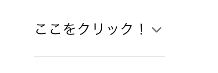

## はじめに

以前、Qiitaに投稿した[巷で噂のshadcn/uiをNext.jsで使ってみた](https://qiita.com/twrcd1227/items/d4a67bb155503fde30f5)という記事は、多くの方に読んでいただきました。特にこの記事は現在も多くの方にご覧いただいており、大変うれしく思っています。

<BlogCard url="https://qiita.com/twrcd1227/items/d4a67bb155503fde30f5" />

そこで今回は、最新のNext.js 15とReact 19に対応したshadcn/uiの使い方を改めて解説していきたいと思います。これから新しいプロジェクトで採用を検討している方や、既存のプロジェクトでのバージョンアップを検討している方のお役に立てれば幸いです。

## shadcn/uiとは？

<BlogCard url="https://ui.shadcn.com/" />

Qiitaの記事にも書いているのですが、[shadcn/ui](https://ui.shadcn.com/)とはまず何かを紹介したいと思います。shadcn/uiとは、 [Radix UI](https://www.radix-ui.com/)と[Tailwind CSS](https://tailwindcss.com/)を使って書かれた UI コンポーネントをまとめたもので、Tailwind CSS でスタイルをカスタマイズできます。

shadcn/uiは、**柔軟性** と **拡張性** が高く、必要なコンポーネントだけを選択し、自分でカスタマイズすることができます。また、通常のコンポーネントライブラリとは異なり、npmパッケージとして配布されていないので、**npmの依存関係に影響しません**。また、コンポーネントのコードはCLIでダウンロードすることができます。

## 環境

この記事では、Next.js 15, React 19で実際に`shadcn/ui`をインストールしていきます。執筆時点の shadcn/uiのバージョンは`2.1.8`です。また、記事内では、srcディレクトリ、App RouterでNext.jsを実行しておりますが、Pages Routerやsrcディレクトリを使わない場合、Next.js 15・React 19以前のバージョンでも同じようにインストールは可能です。

## インストール

`npx shadcn@latest init`をターミナルで叩いてインストールします。

```sh
$ npx shadcn@latest init
Need to install the following packages:
shadcn@2.1.8
Ok to proceed? (y) y
? Which style would you like to use? › # New YorkかDefaultのどちらのスタイルにするか選択する
❯   New York
    Default
? Which color would you like to use as the base color? › # ベースカラーを以下から選ぶ
❯   Neutral
    Gray
    Zinc
    Stone
    Slate
? Would you like to use CSS variables for theming? › no / yes
# Next.js 15, React19を使用している場合はさらに以下の質問があります。
? How would you like to proceed? › 以下どちらのオプションを使用してインストールするかを選択する
    Use --force # 依存関係の競合やエラーを無視して強制的にインストールする
❯   Use --legacy-peer-deps # 互換性を維持しながらインストールする
```

ちなみに、スタイルについては、 https://ui.shadcn.com/docs/components/accordion でコンポーネントごとに、defaultとNewYorkの例をみることができます。また、テーマについては、https://ui.shadcn.com/themes でプレビューを確認することができます。

初期化が完了すると、`components.json`と`src/lib/utils.ts` が作成されます。

```ts title="src/lib/utils.ts"
import { clsx, type ClassValue } from "clsx"
import { twMerge } from "tailwind-merge"

export function cn(...inputs: ClassValue[]) {
  return twMerge(clsx(inputs))
}
```

```json title="components.json"
{
  "$schema": "https://ui.shadcn.com/schema.json",
  "style": "new-york",
  "rsc": true,
  "tsx": true,
  "tailwind": {
    "config": "tailwind.config.ts",
    "css": "src/app/globals.css",
    "baseColor": "neutral",
    "cssVariables": true,
    "prefix": ""
  },
  "aliases": {
    "components": "@/components",
    "utils": "@/lib/utils",
    "ui": "@/components/ui",
    "lib": "@/lib",
    "hooks": "@/hooks"
  },
  "iconLibrary": "lucide"
}
```

## componentsを導入する

ここではNext.jsで試しに `accordion` をインストールする。

```sh
$ npx shadcn@latest add accordion
? How would you like to proceed? › 以下どちらのオプションを使用してインストールするかを選択する
❯   Use --force # 依存関係の競合やエラーを無視して強制的にインストールする
    Use --legacy-peer-deps # 互換性を維持しながらインストールする
```

すると、`components/ui/accordion.tsx` が作成されます。

<Accordion title="accordion.tsx">

```tsx title="components/ui/accordion.tsx"
"use client"

import * as React from "react"
import * as AccordionPrimitive from "@radix-ui/react-accordion"
import { ChevronDown } from "lucide-react"

import { cn } from "@/lib/utils"

const Accordion = AccordionPrimitive.Root

const AccordionItem = React.forwardRef<
  React.ElementRef<typeof AccordionPrimitive.Item>,
  React.ComponentPropsWithoutRef<typeof AccordionPrimitive.Item>
>(({ className, ...props }, ref) => (
  <AccordionPrimitive.Item
    ref={ref}
    className={cn("border-b", className)}
    {...props}
  />
))
AccordionItem.displayName = "AccordionItem"

const AccordionTrigger = React.forwardRef<
  React.ElementRef<typeof AccordionPrimitive.Trigger>,
  React.ComponentPropsWithoutRef<typeof AccordionPrimitive.Trigger>
>(({ className, children, ...props }, ref) => (
  <AccordionPrimitive.Header className="flex">
    <AccordionPrimitive.Trigger
      ref={ref}
      className={cn(
        "flex flex-1 items-center justify-between py-4 text-sm font-medium transition-all hover:underline text-left [&[data-state=open]>svg]:rotate-180",
        className
      )}
      {...props}
    >
      {children}
      <ChevronDown className="h-4 w-4 shrink-0 text-muted-foreground transition-transform duration-200" />
    </AccordionPrimitive.Trigger>
  </AccordionPrimitive.Header>
))
AccordionTrigger.displayName = AccordionPrimitive.Trigger.displayName

const AccordionContent = React.forwardRef<
  React.ElementRef<typeof AccordionPrimitive.Content>,
  React.ComponentPropsWithoutRef<typeof AccordionPrimitive.Content>
>(({ className, children, ...props }, ref) => (
  <AccordionPrimitive.Content
    ref={ref}
    className="overflow-hidden text-sm data-[state=closed]:animate-accordion-up data-[state=open]:animate-accordion-down"
    {...props}
  >
    <div className={cn("pb-4 pt-0", className)}>{children}</div>
  </AccordionPrimitive.Content>
))
AccordionContent.displayName = AccordionPrimitive.Content.displayName

export { Accordion, AccordionItem, AccordionTrigger, AccordionContent }
```

</Accordion>

インストールした`Accordion`を以下のようにpage.tsxからインポートします。

```tsx title="src/app/sample/page.tsx"
import {
  Accordion,
  AccordionContent,
  AccordionItem,
  AccordionTrigger,
} from "@/components/ui/accordion";

export default function Page() {
  return (
    <Accordion type="single" collapsible>
      <AccordionItem value="item-1">
        <AccordionTrigger>ここをクリック！</AccordionTrigger>
        <AccordionContent>Hello!</AccordionContent>
      </AccordionItem>
    </Accordion>
  );
}
```

`npm run dev`して、https://localhost:3000/sample にアクセスすると以下のように表示されます。



そのほかのコンポーネントも同様にインストール可能です。どのようなコンポーネントが存在するかは https://ui.shadcn.com/docs/components/accordion に詳細が全て載っています。

## chartを導入する

Rechartという機能を使って、さまざまなグラフを簡単に導入することができます。どのようなグラフがあるかは、 https://ui.shadcn.com/charts で確認することができます。

chartを導入する場合は、`package.json`を以下を追記します。

```json title="package.json"
"overrides": {
  "react-is": "^19.0.0"
}
```

`npm install --legacy-peer-deps`をして、あとは上記の[componentsを導入する](#componentsを導入する) と同じく`npx shadcn@latest add chart`をターミナルで叩けば使用可能です。

## 終わりに

他にも[Figma](https://qiita.com/twrcd1227/items/d4a67bb155503fde30f5#figma)との連携やCSS変数やユーティリティクラスの使い方、ダークテーマの使い方について知りたい方は、Qiitaの記事の[巷で噂のshadcn/uiをNext.jsで使ってみた](https://qiita.com/twrcd1227/items/d4a67bb155503fde30f5)を参考にしてみてください。

<BlogCard url="https://qiita.com/twrcd1227/items/d4a67bb155503fde30f5" />
